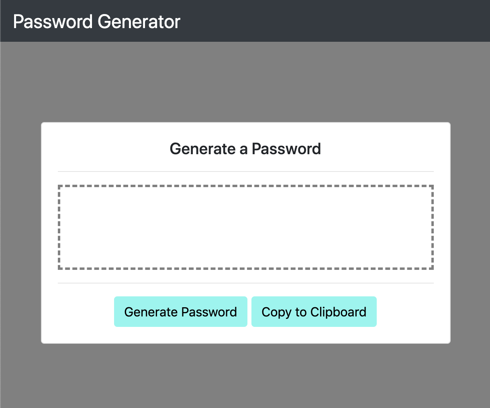

# Password Generator

## Purpose
For companies that handle large amounts of sensitive data, weak passwords can pose a real security threat. An application that can generate strong passwords quickly and effortlessly saves employees time and ensures secure access to data. 

## Description
This application generates a random password based on user-selected criteria. This app will run in the browser and feature dynamically updated HTML and CSS powered by bootstrap.

The user is prompted to choose from the following password criteria:

* Length (must be between 8 and 128 characters)

* Character type:

  * Special characters

  * Numeric characters

  * Lowercase characters

  * Uppercase characters

The application validates user input and ensure that at least one character type is selected.

After all prompts are answered, the user is presented with a password matching the answered prompts.

## Images

## Links

